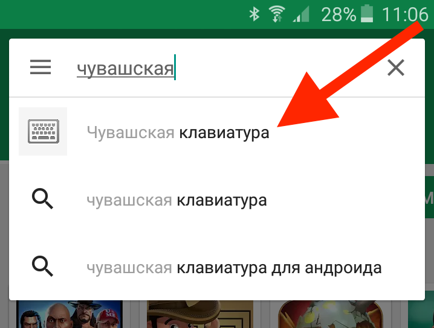

# Установка чувашской клавиатуры
Информация записана и обновлена Мирон Толи 
@mirontoli 2017-02-02.

1. [Windows](#windows)
1. [Android](#android)
1. [iOS](#ios)
1. [Linux](#linux)
1. [Mac](#mac)
1. [Web](#web)

## Windows
Чувашская клавиатура позволяет вам печатать текст на русском как и прежде. Вы также получаете доступ к чувашским буквам Ӑ Ӗ Ҫ Ӳ. 
Они набираются при помощи сочетания клавиш <kbd>AltGr</kbd> (правая кнопка Alt) и клавиш А Е С У.
Нажмите на <kbd>AltGr</kbd>, и не отпуская ее нажмите на А. У вас получится **Ӑ**. 

### Инструкция для установки

1. Скачайте [установочный файл](http://bit.ly/cv-kbd-win). Распакуйте его. 

2. Установите файл `setup.exe`

   

3. Закройте окно после установки
  

4. Готово! Чтобы поменять раскладку на чувашскую, нажмите на языковую панель.
  

### Дополнительные буквы
В качестве бонуса у вас есть доступ к старинным чувашским буквам Золотницкого, Яковлева и Ашмарина, 
а также символы использующиюся в форматировании статей в Википедии. Заинтересованные могут узнать подробности на [страничке проекта раскладки Ашмарина](http://bit.ly/asm-kbd). 

## Android

Установите ["чувашскую раскладку"](http://bit.ly/cv-kbd-android) с Play Маркет. Следуйте инструкциям в приложении. 

Найдите приложение в Play Маркете:



Нажмите на "Установить"


Откройте приложение:


Нажмите на "1. Ҫак сарӑма ҫутӑр" (в переводе: Включите эту раскладку):


Активируйте "Чӑваш сарӑмӗ" (в переводе: Чувашская раскладка):


Когда откроется предупреждение, нажмите на "ОК". 


Выберите клавиатуру, нажав на "2. Ҫак сарӑма суйлӑр" (в переводе: выберите эту клавиатуру). 
В всплывшем меню нажмите на "Чӑвашла":


## iOS

Установите приложение [Чувашская клавиатура](http://bit.ly/cv-kbd-ios) Андрея Фетисова. Приложение стоит приблизительно 70 рублей.


Откройте приложение и настройте клавиатуру как указано в инструкции в приложении:


## Linux

Чувашская раскладка на Линуксе - полноценная встроенная раскладка. Работает, как и на Виндовсе, при помощи сочетания клавишы <kbd>AltGr</kbd> и букв  А Е С У. 
Позволяет печатать и русский текст как и прежде. 

### Инструкция по установке
Покажем пошаговую инструкцию для популярной системы Ubuntu.

1. Правой кнопкой мыши нажмите на языковой значок в правом верхнем углу экрана.

  

1. В появившемся окне нажмите на <kbd>+</kbd> чтобы добавить дополнительную раскладку. Напишите `chu` и нажмите на <kbd>Add</kbd>. 

  

1. Готово! Чтобы поменять раскладку, нажмите на языковой значок. 

## Mac

Чувашская раскладка на Mac также как и на Windows позволяет вам печатать русский текст 
и чувашский при помощи сочетания клавишы <kbd>⌥</kbd> (левый или правый Option) и букв А Е С У.


### Установка
1. Сохраниту установочный файл [ChuvashKeyboardOSX.bundle.zip](http://bit.ly/cv-kbd-mac) и распакуйте его.

  

1. Откройте скрытую папку `~/Library/Keyboard\ Layouts/` при помощи Терминала:
  
  ```open ~/Library/Keyboard\ Layouts/```

  

1. Скопируйте `ChuvashKeyboardOSX.bundle` в папку `Keyboard Layouts`.

  

1. Перезагрузите компьютер

1. Зайдите в настройки клавиатуры и добавьте `Chuvash - PC`. 

  

Готово!

### Дополнительные буквы

В чувашскую раскладку для Mac OS мы добавили множество дополнительных букв: старых чувашских и букв других народов Российской Федерации. 
Если у вас есть интерес и надобность писать тексты на русском, чувашском, татарском, и скажем, на удмуртском, посмотрите подробности на 
[странице проекта раскладки для Mac OS](https://github.com/mirontoli/chuvash-kbd/tree/master/Mac)

## Web
Если вы у чужого компьютера или у вас нет прав устанавливать программы на компьютере (например, на работе), 
то вы можете воспользоваться виртуальной клавиатурой через ваш браузер. Зайдите на адрес [chuvashskaya.klaviatura.su](http://bit.ly/cv-kbd-web). Набрав текст на чувашском, скопируйте его куда вам надо.


